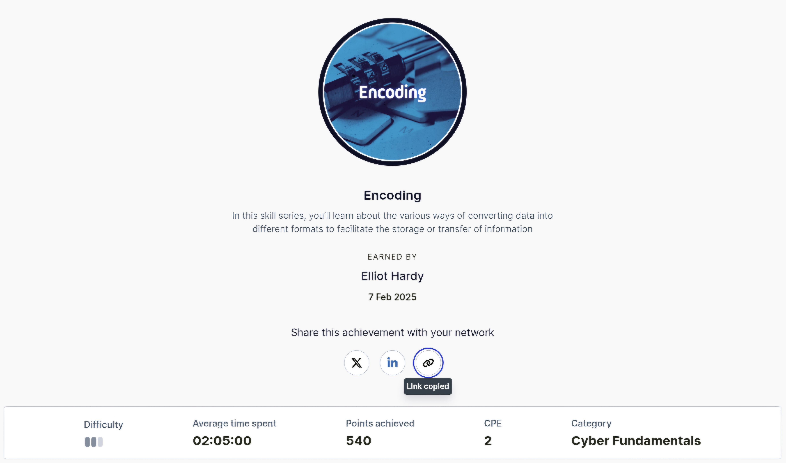

**Hashing and Encoding**

In this skill collection, I learnt about the various ways of converting data into different formats to facilitate the storage or the secure transfer of information.

Here is the badge I recieved for finishing the module and also the link to view my completion.

**Badge**  

**Link**  
[Hashing and Encoding](https://api.immersivelabs.online/share/achievements/f622ad608b76e184dec20e84120a4f1e)
