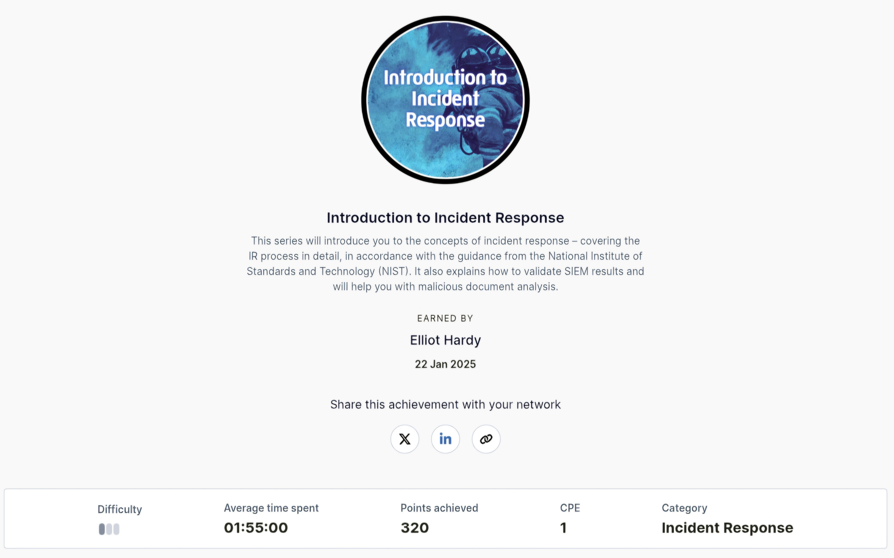

**- Introduction to Incident Response**
--- 

In this skill collection, I learnt about the various ways of converting data into different formats to facilitate the storage or the secure transfer of information.

Here is the badge I recieved for finishing the module and also the link to view my completion.

**- Badge**

  

**- Link**  
[Introduction to Incident Response](https://api.immersivelabs.online/share/achievements/95dabf678d335112dc9e2ca4328afe12)

