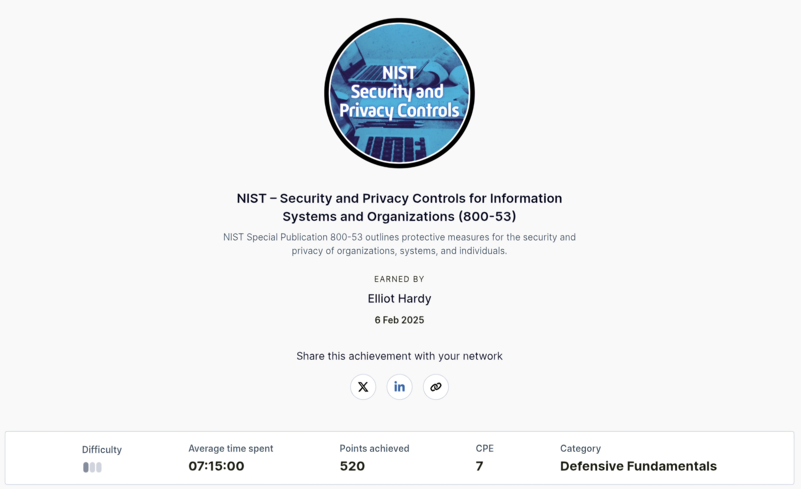

**- NIST Security and Privacy Controls**
--- 

This series introduced me to the concepts of incident response – covering the IR process in detail, in accordance with the guidance from the National Institute of Standards and Technology (NIST). It also explains how to validate SIEM results and will helped me with malicious document analysis.

Here is the badge I recieved for finishing the module and also the link to view my completion.

**- Badge**

  

**- Link**  
[NIST Security and Privacy Controls](https://api.immersivelabs.online/share/achievements/a3af4dca6321defdebad11bc624769ca)
