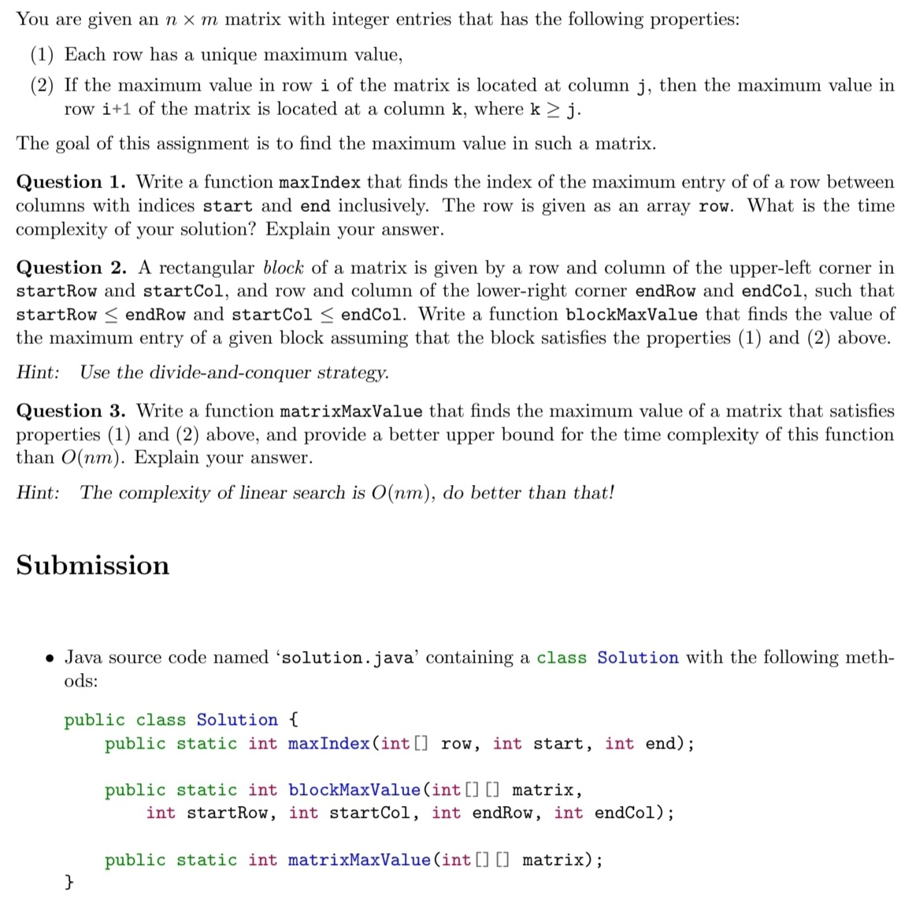
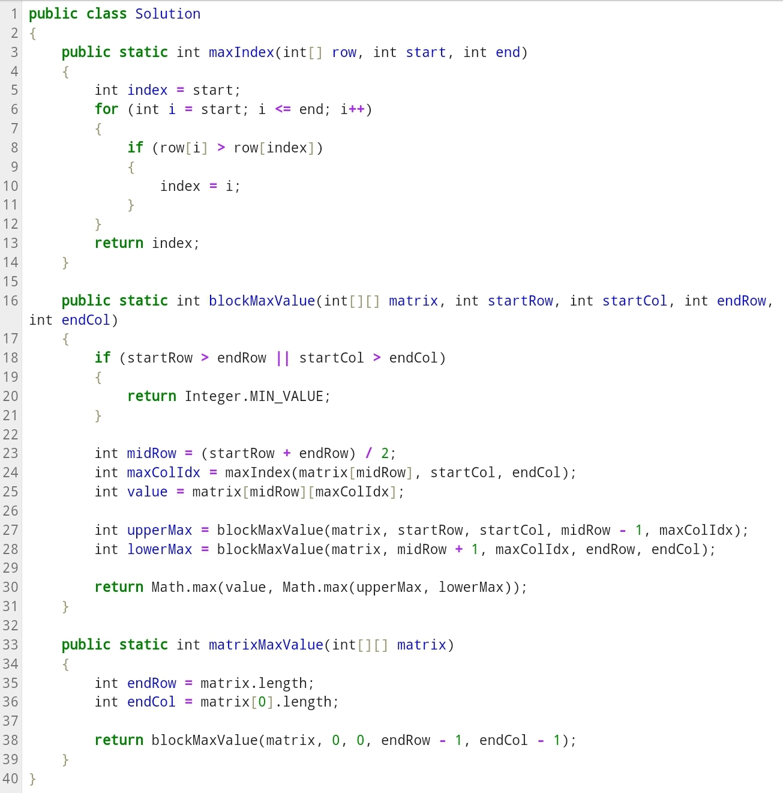

**-Finding The Maximum Value in a Matrix**  

For this project I was tasked with answering these 3 questions and passing the specified tests,  
I was also tasked with working out the time complexity of each function and writing this up as a pdf file.   
which can be found here:
[WriteUp](./WriteUp)  
In this writeup we were not required to discuss how we came up with our algorithms so I will discuss this further down this README file:

The test cases for each function are as follows:

Question 1 (maxIndex):
-
int[] row = {1, 3, 2, -1, 0, 1}; int start = 0, end = 5, output = 1;     
testMaxIndex(row, start, end, output);  

int[] row = {3, 2, -1, 0, 1}; int start = 2, end = 4, output = 4;     
testMaxIndex(row, start, end, output);  

int[] row = {1, -1,-3, -2}; int start = 1, end = 3, output = 1;    
testMaxIndex(row, start, end, output);   

Question 2 (blockMaxValue):
-
int[][] matrix = {{1, 7, 6}, {3, 8, 5}, {4, 2, 9}}; int startRow = 0, startCol = 0, endRow = 0, endCol = 2;   
int output = 7;   
testBlockMaxValue(matrix, startRow, startCol, endRow, endCol, output);   

int[][] matrix = {{3}, {2}, {-1}, {0}, {1}}; int startRow = 2, startCol = 0, endRow = 4, endCol = 0;   
int output = 1;   
testBlockMaxValue(matrix, startRow, startCol, endRow, endCol, output);   

int[][] matrix = {{1, -1, -2, -4}, {-1, -3, -2, -5}, {1, 2, -2, -1}}; int startRow = 0, startCol = 2, endRow = 2, endCol = 3;   
int output = -1;  
testBlockMaxValue(matrix, startRow, startCol, endRow, endCol, output);   

Question 3 (matrixMaxValue):
-
int[][] matrix = {{1, 7, 6}, {3, 8, 5}, {4, 2, 9}};   
int output = 9;   
testMatrixMaxValue(matrix, output);   

int[][] matrix = {{3}, {2}, {-1}, {0}, {1}};   
int output = 3;   
testMatrixMaxValue(matrix, output);  

int[][] matrix = {{1,-1, -2, -4}, {-1, -3, -2, -5}, {1, 2, -2, -1}};   
int output = 2;   
testMatrixMaxValue(matrix, output);  

Solution code:
-

